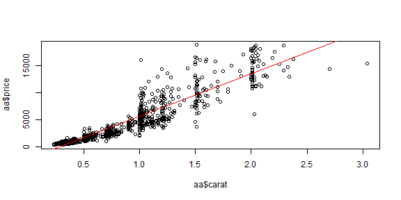

<style>
strong {
  font-weight: bold;
}
</style>
  
<style>
em {
  font-style: italic
}
</style>


## Step 1:  Form of Data

-  ***Data Science is most effectively used for data sets that have a number of identifiable "Observations" where each observation share the same parameters/columns.***

---

## Step 1:  Form of Data

-  Data Science is most effectively used for data sets that have a number of identifiable "Observations" or "Subjects" where each observation/subject shares  a number of common "data points".

-  ***An ideal form for such data is a spreadsheet with the rows being the individual observations and the columns the common data points.***

---


## Step 1:  Form of Data

-  ***An ideal form for such data is a spreadsheet with the rows being individual observations/subjects and the columns the common data points.   - The following is an example***


```
## # A tibble: 8 x 7
##   carat cut       color clarity depth table price
##   <dbl> <ord>     <ord> <ord>   <dbl> <dbl> <int>
## 1 0.23  Ideal     E     SI2      61.5    55   326
## 2 0.21  Premium   E     SI1      59.8    61   326
## 3 0.23  Good      E     VS1      56.9    65   327
## 4 0.290 Premium   I     VS2      62.4    58   334
## 5 0.31  Good      J     SI2      63.3    58   335
## 6 0.24  Very Good J     VVS2     62.8    57   336
## 7 0.24  Very Good I     VVS1     62.3    57   336
## 8 0.26  Very Good H     SI1      61.9    55   337
```

---


## Step 1:  Form of Data

-  ***The Data Scientist refers to  the rows as "Observations" and the columns as "Variables".***  
If you wanted to investigate what influences "price" - then the ***price*** variable would be the ***dependent*** variable and the other variables would be known as ***predictors/independent*** variables.


---

## Step 1:  Form of Data


-  ***No matter how the data begins - it is important that it is eventually converted into the "spreadsheet" like format.***


---

## Step 1:  Form of Data Example


```
## # A tibble: 53,940 x 7
##    carat cut       color clarity depth table price
##    <dbl> <ord>     <ord> <ord>   <dbl> <dbl> <int>
##  1 0.23  Ideal     E     SI2      61.5    55   326
##  2 0.21  Premium   E     SI1      59.8    61   326
##  3 0.23  Good      E     VS1      56.9    65   327
##  4 0.290 Premium   I     VS2      62.4    58   334
##  5 0.31  Good      J     SI2      63.3    58   335
##  6 0.24  Very Good J     VVS2     62.8    57   336
##  7 0.24  Very Good I     VVS1     62.3    57   336
##  8 0.26  Very Good H     SI1      61.9    55   337
##  9 0.22  Fair      E     VS2      65.1    61   337
## 10 0.23  Very Good H     VS1      59.4    61   338
## # ... with 53,930 more rows
```


---

## Step 2: Initial Data Prep

- Effective use of Data Science requires close cooperation between the "Subject Experts" (often considered the clients of the Data Scientist) and the Data Scientist.
- ***Note new variables x, y and z - As an example: Subject experts know that the depth variable is calculated from x,y&z***


---

## Step 2: Initial Data Prep

- ***Subject Experts should carefully consider the variables and be prepared to discuss eliminating redundant columns.***


---

## Step 2: Initial Data Prep - eliminating redundant variables


- Running custom code gives a table showing correlation between depth and x,y&z


---

## Step 2: Initial Data Prep - eliminating redundant variables cont.

Since x,y&z were shown to be highly correlated to depth - they are removed from the dataframe.   We look at the other potential variables to see if strong correlations exist. Note the correlations are relativel low - therefore all these variables are not removed.


---

## Step 2: Initial Data Prep - Plot Example




---

## Step 2: Initial Data Prep - Example of stats


```
## [1] "The AdjustRsq using only the carat variable is: 0.85"
```

```
## [1] "The AdjustRsq using all variables is: 0.90"
```

```
## [1] "The AdjustRsq using bestfit variables is: 0.93"
```

```
## price ~ carat + clarity + color + cut + table + depth + carat:clarity + 
##     carat:color + clarity:color + carat:cut + clarity:cut + carat:table + 
##     clarity:table + carat:depth + cut:depth + cut:table + table:depth + 
##     color:table + carat:clarity:color + carat:clarity:cut + carat:cut:depth + 
##     carat:table:depth + cut:table:depth + carat:cut:table + clarity:cut:table + 
##     carat:clarity:table + carat:color:table + carat:cut:table:depth + 
##     carat:clarity:cut:table
```

---


## Step 2: Initial Data Prep - Another example of stats


```
## [1] "The Mean Absolute Error for carat only variable is: 1013.06"
```

```
## [1] "The Mean Absolute Error for all variables is: 856.23"
```

```
## [1] "The Mean Absolute Error for fitbest variables is: 755.58"
```

---


## Step 3:  Questions/Goals

- ***The process of answering questions is the main purpose of Data Science.   This is perhaps the most important step.   It can also be the most difficult step.*** 

---


## Step 3:  Questions/Goals


- The process of answering questions is the main purpose of Data Science.   This is perhaps the most important step.   It can also be the most difficult step.  
- ***It is true that the data dictates which questions can be answered and to what degree of certainty,   however knowing where to start can save a lot of time.*** 

---


## Step 3:  Questions/Goals


- The process of answering questions is the main purpose of Data Science.   This is perhaps the most important step.   It can also be the most difficult step.  
- It is true that the data dictates which questions can be answered and to what degree of certainty,   however knowing where to start can save a lot of time. 
- ***Note that the data science process often produces better questions than initially envisioned and some Data Science is pursued without initially having any specific questions in mind in an attempt to see what the data might reveal.***
   

---


## Step 3:  Questions/Goals


- The process of answering questions is the main purpose of Data Science.   This is perhaps the most important step.   It can also be the most difficult step.  
- It is true that the data dictates which questions can be answered and to what degree of certainty,   however knowing where to start can save a lot of time. 
- Note that the data science process often produces better questions than initially envisioned and some Data Science is pursued without initially having any specific questions in mind in an attempt to see what the data might reveal.    
- ***Initial questions are often general in nature and subject to modification as data is looked at.    Examples of questions could include: "what is causing the errors?" or "which firmware performs best?" or "how does the performance change overtime?.***  

---

## Step 4: What to expect

https://garyfh.shinyapps.io/squelch20e/


---


## Step 4: What to Expect 


```
## # A tibble: 35,999 x 39
##    ID    testcase ctrl_id sequence_num drive_slot serial link  dev_name
##    <fct> <fct>      <int>        <int> <fct>      <fct>  <fct> <fct>   
##  1 1     Z284cb1        0            0 1          BTLD7~ 8 GT~ nvme8   
##  2 2     Z284cb1        0            0 2          BTLD7~ 8 GT~ nvme9   
##  3 3     Z284cb1        0            0 3          PHLD7~ 8 GT~ nvme10  
##  4 4     Z284cb1        0            0 4          BTLD7~ 8 GT~ nvme11  
##  5 5     Z284cb1        0            0 5          PHLD7~ 8 GT~ nvme4   
##  6 6     Z284cb1        0            0 6          BTLD7~ 8 GT~ nvme5   
##  7 7     Z284cb1        0            0 7          BTLD7~ 8 GT~ nvme6   
##  8 8     Z284cb1        0            0 8          BTLD7~ 8 GT~ nvme7   
##  9 9     Z284cb1        0            0 9          PHLD7~ 8 GT~ nvme0   
## 10 10    Z284cb1        0            0 10         BTLD7~ 8 GT~ nvme1   
## # ... with 35,989 more rows, and 31 more variables: bdf <fct>,
## #   Upstream.status <fct>, Upstream.un_err <fct>, Upstream.cor_err <fct>,
## #   Upstream.frm <fct>, SSD.status <fct>, SSD.un_err <fct>,
## #   SSD.cor_err <fct>, Upstream.lane.0 <fct>, Upstream.lane.1 <fct>,
## #   SSD.lane.0 <fct>, SSD.lane.1 <fct>, hostname <fct>, beforeIO <fct>,
## #   fio.runtime <dbl>, Up.bad.dllp <dbl>, Up.bad.tlp <dbl>,
## #   Up.port.err <dbl>, UpstreamREC <dbl>, HexSum <dbl>, RateUp <dbl>,
## #   RateSSD <dbl>, ComboErr <dbl>, errortype2 <dbl>, Errortype <fct>,
## #   errortype1 <dbl>, ErrortypeB <fct>, UpLaneTot <chr>, SSDLaneTot <chr>,
## #   UpLaneErr <dbl>, SSDLaneErr <dbl>
```


---

## Step 4: What to Expect - create new variables


```
## [1] "Variable called Upstream.lane.0 =  0x80003906-P5"
```

```
## [1] "5th&6th elements converted to dec - uplane0a= 0"
```

```
## [1] "7th&8th elements converted to dec - uplane0b= 57"
```

```
## [1] "9th&10th elements converted to dec - uplane0c= 6"
```


---

## Step 5:  Report type.

- ***During the process of working with the data,  numerous reports will be available - initially these are "working" documents whose purpose is to guide the team toward their goals.    The Data Scientist should maintain these reports and avoid writing over previous reports so that prior reports are always available.***   

---

## Step 5:  Report type.

- During the process of working with the data,  numerous reports will be available - initially these are "working" documents whose purpose is to guide the team toward their goals.    The Data Scientist should maintain these reports and avoid writing over previous reports so that prior reports are always available.   
- ***The need to provide interested parties with the ability to closely examine the data as the process unfolds often results in reports that are layered from overview charts down to detailed tables/plots.  Rarely does one chart/plot/table exist that provides what is needed exist.   Different report users will have multiple questions they want to investigate - thus "one size" does not fit all.***

---

## Step 5:  Report type.

- During the process of working with the data,  numerous reports will be available - initially these are "working" documents whose purpose is to guide the team toward their goals.    The Data Scientist should maintain these reports and avoid writing over previous reports so that prior reports are always available.   

- The need to provide interested parties with the ability to closely examine the data as the process unfolds often results in reports that are layered from overview charts down to detailed tables/plots.  Rarely does one chart/plot/table exist that provides what is needed exist.   Different report users will have multiple questions they want to investigate - thus "one size" does not fit all.

- ***Publishing reports so that the team members can interact with the data and look at as much detail as they desire is important.   Thus,  interactive graphs/tables/plots are important.***

---

## Step 6:  Statistics.

- ***The Data Scientist uses statistical analysis to measure the strength of the relationship between variables - this can be used to remove redundant or weak variables.***


---

## Step 6:  Statistics - Example

- ***Lets look at a dataset of bank customers with the goal of finding out why customers leave the bank***


```
## # A tibble: 10,000 x 11
##    Exited CreditScore Geography Gender   Age Tenure Balance NumOfProducts
##    <fct>        <int>     <dbl>  <dbl> <int>  <int>   <dbl>         <int>
##  1 1              619         1      1    42      2      0              1
##  2 0              608         2      1    41      1  83808.             1
##  3 1              502         1      1    42      8 159661.             3
##  4 0              699         1      1    39      1      0              2
##  5 0              850         2      1    43      2 125511.             1
##  6 1              645         2      2    44      8 113756.             2
##  7 0              822         1      2    50      7      0              2
##  8 1              376         3      1    29      4 115047.             4
##  9 0              501         1      2    44      4 142051.             2
## 10 0              684         1      2    27      2 134604.             1
## # ... with 9,990 more rows, and 3 more variables: HasCrCard <int>,
## #   IsActiveMember <int>, EstimatedSalary <dbl>
```

---

## Step 6:  Statistics - Example

- ***Statistical Analysis gives list of 'Important and Not Important Variables***


---

## Step 6:  Statistics - Example

- ***You can plot the important variables***


---


## Step 6:  Statistics.

- The Data Scientist uses statistical analysis to measure the strength of the relationship between variables - this can be used to remove redundant or weak variables.
- ***Statistics can also indicate when the data available does not contain the information needed to accurately predict an answer.***


---

## Step 6:  Statistics.

- The Data Scientist uses statistical analysis to measure the strength of the relationship between variables - this can be used to remove redundant or weak variables.
- Statistics can also indicate when the data available does not contain the information needed to accurately predict an answer.
- ***Determining the strength of the relationship between variables can uncover related variables that were not initially thought to be related.***

---

## Step 6:  Statistics.

- The Data Scientist uses statistical analysis to measure the strength of the relationship between variables - this can be used to remove redundant or weak variables.
- Statistics can also indicate when the data available does not contain the information needed to accurately predict an answer.
- Determining the strength of the relationship between variables can uncover related variables that were not initially thought to be related.
- ***In many cases the Data Scientist uses the relationship between variables to "predict" an outcome - the best predictive algorithms typically involve a combination of variables and can include creating new variables from combinations of the original variables.***

---

## Step 7:  AI/DeepLearning/Neural Networks

- ***At a recent Data Science Convention, a speaker stated that when computers were first used to play Chess,  it was considered to be AI - but now a computer chess game is just considered a program.    Data Scientists currently consider a program to be AI when the programmer does specify variables to be considered but lets the program determine it's own variables.***

---

## Step 7:  AI/DeepLearning/Neural Networks

- At a recent Data Science Convention, a speaker stated that when computers were first used to play Chess,  it was considered to be AI - but now a computer chess game is just considered a program.    Data Scientists currently consider a program to be AI when the programmer does specify variables to be considered but lets the program determine it's own variables.
- ***An example is Photo recognition software,  when the programmer does not tell the computer what characteristics to look for but just gives the computer a number of identified photos and allows the computer to train itself - this is an example of AI.   Artificial Neural Networks are typically predictive algorithms that share some similarities to how a human brain works - they take a lot of processing power.***

---


